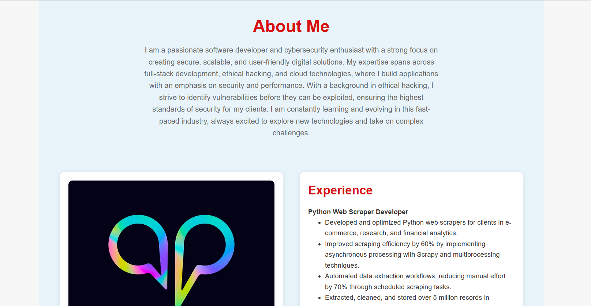
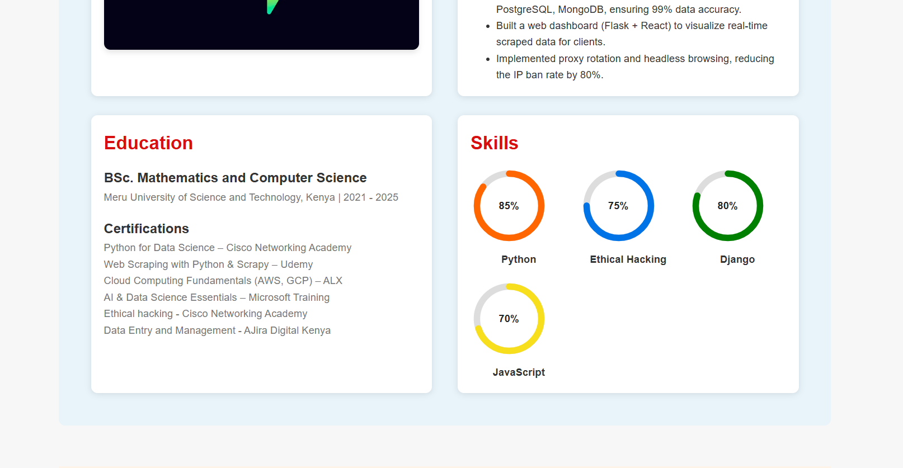
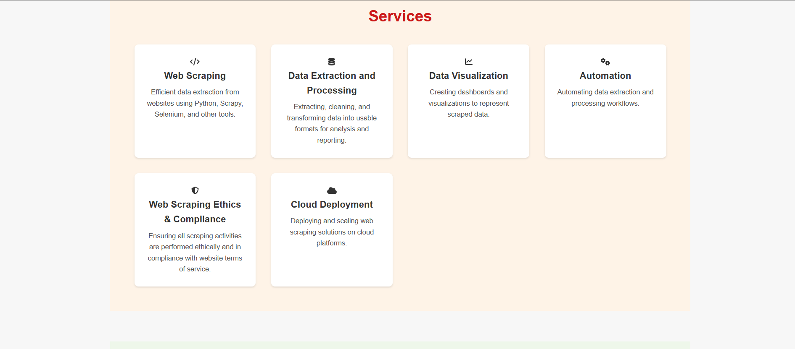
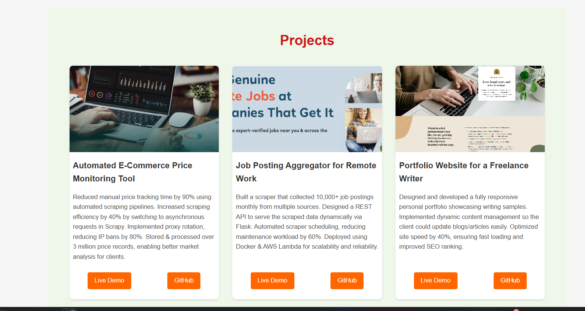
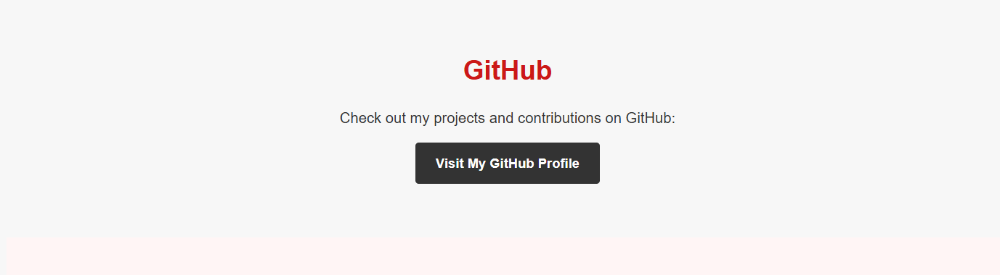
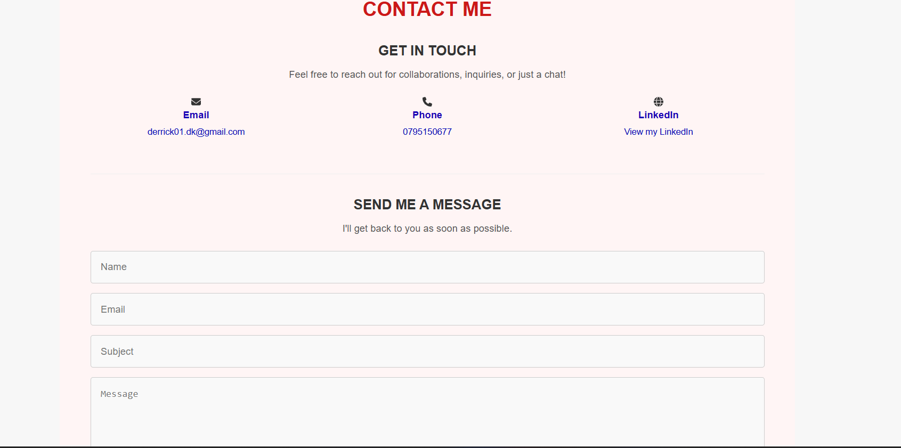
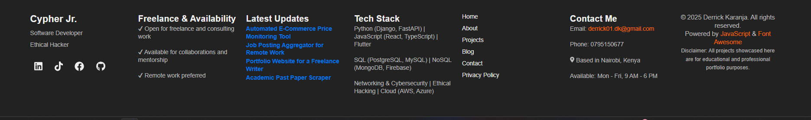

🌐 Portfolio Web 💼
Showcasing my skills, experience & passion for development

✨ Overview
Welcome to my personal portfolio website — a digital hub that highlights my skills, projects, and services as a passionate web developer. This platform is crafted not just to display my work but to inspire confidence in potential employers and clients.

🚀 Features
🔹 Home – A warm welcome with quick access to social profiles.
🔹 About – Insight into my background, education, and skillset.
🔹 Services – What I offer: from website development to debugging and consulting.
🔹 Projects – A showcase of my recent work with live links and descriptions.
🔹 Testimonials – What clients and collaborators have to say.
🔹 GitHub Integration – Connects directly to my open-source projects.
🔹 Contact – Easy ways to reach me via a form or direct links.

🖼️ Visual Preview
🏠 Home

👤 About Me

🛠️ Services

📂 Projects

💻 GitHub Section

✉️ Contact

🔻 Footer

🧰 Tech Stack
Built with ❤️ using:

* HTML5
* CSS3
* JavaScript
* Python
* Flask
* Font Awesome Icons

🙌 Credits
🖌️ Design: Derricks
💻 Development: Cypher Jr.

📬 Let’s Connect!
📧 Email: derrick01.dk@gmail.com
🐙 GitHub: github.com/derksKCodes
🌐 Portfolio Live: https://derkskcodes.github.io/Portfolio-Web/