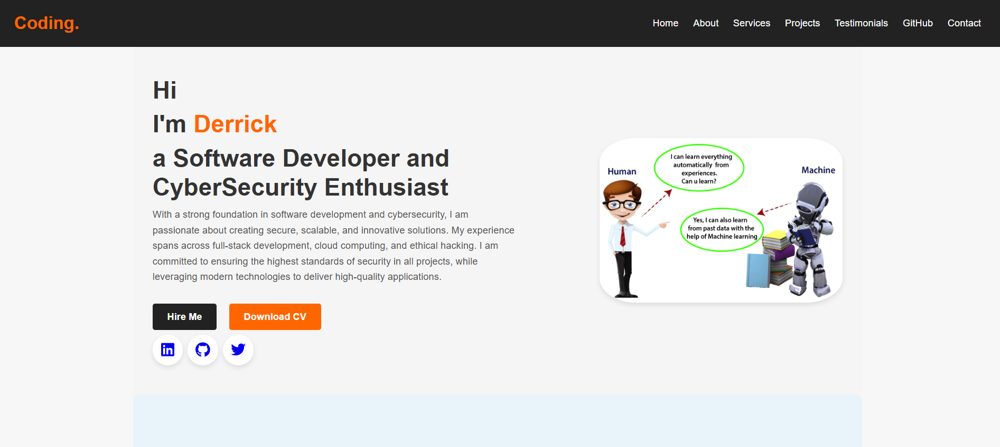
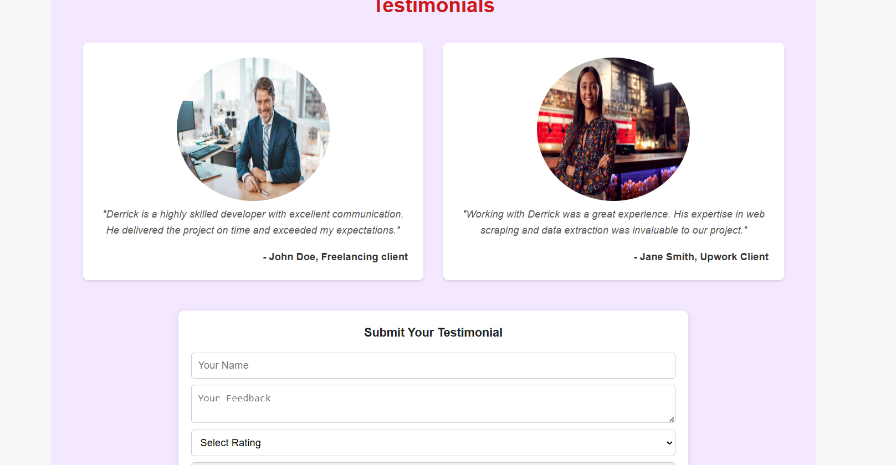

================
# 🌐 Portfolio Web 💼

Showcasing my skills, experience & passion for development

## 🧭 Overview

This portfolio website showcases my skills, projects, and experience as a web developer. It's designed to provide a comprehensive view of my abilities and make it easy for potential employers or clients to get in touch.

## ✨ Features

* **Home:** Introduces me and provides links to my social media.
* **About:** Details my skills and education.
* **Services:** Lists the services I offer.
* **Projects:** Showcases my projects with descriptions and links.
* **Testimonials:** Displays testimonials from satisfied clients.
* **GitHub:** Links to my GitHub profile.
* **Contact:** Provides a form and contact information for getting in touch.

## 🖼️ Screenshots

### 🏠 Home Section

### 👤 About Section

### 🛠️ Services Section

### 📂 Projects Section

### 💬 Testimonials Section

### 🧑‍💻 GitHub Section

### ✉️ Contact Section

### 🔻 Footer Section

## 🧰 Tech Stack

* HTML
* CSS
* JavaScript
* Font Awesome
* Python
* Flask

## 🙌 Credits

* Design: Derricks
* Development: Cypher Jr.

## 📬 Let’s Connect!

* 🐙 [GitHub](github.com/derksKCodes)
* 🔗 [LinkedIn ]([https://ke.linkedin.com/in/derks01](https://ke.linkedin.com/in/derks01?trk=people-guest_people_search-card))
* 🌍 [My Portfolio](https://derkskcodes.github.io/Portfolio-Web/)

